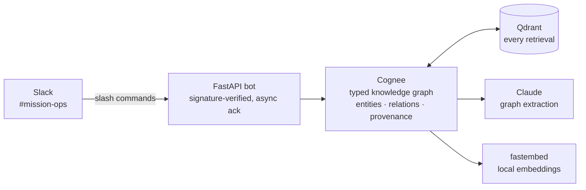

# Decision Archaeology

### Giving a Slack workspace real memory

<div class="pt-8 text-xl opacity-80">
Cognee 🧠 &nbsp;+&nbsp; Qdrant 🔍 &nbsp;— self-hosted
</div>

<div class="pt-12 text-sm opacity-60">
Bhargav · Harshad · Mahesh &nbsp;|&nbsp; Meridian Robotics (fictional)
</div>

<!--
~10s. "Every company's decisions live in Slack — scattered, nicknamed, half-reversed. We built decision archaeology."
-->

---
layout: two-cols
layoutClass: gap-8
---

# The problem

A new joiner's day one at a robotics startup:

<v-clicks>

- ❓ **"Why can't I deploy on Fridays?"**
  <span class="text-sm opacity-60">Rule is in the runbook. Reason is spread across 4 messages by 3 people.</span>

- ❓ **"Do we use Redis or not?"**
  <span class="text-sm opacity-60">Channel says both "drop Redis entirely" and "Redis comes back".</span>

- ❓ **"What's wrong with 'the problem child'?"**
  <span class="text-sm opacity-60">A nickname that never appears next to an incident.</span>

</v-clicks>

::right::

<div class="pt-14">

## Why search fails

<v-click>

Keyword search finds **messages**.

These answers live in the **relationships between messages**:

`freeze ← INC-42 ← firmware 2.1.4 ← vendor swap`

No single message contains the chain.

</v-click>

</div>

<!--
~20s. Then: "Normally you'd DM three people and wait. Instead — watch."
-->

---
layout: center
class: text-center
---

# Live demo

<div class="text-left inline-block pt-4">

```text
/cognee-ask-0x why are we not allowed to deploy on Fridays?

/cognee-ask-0x what incidents has the problem child
               been involved in?

/cognee-ask-0x do we use Redis, and for what?
```

</div>

<div class="pt-8 opacity-60">
multi-hop "why" &nbsp;·&nbsp; alias resolution &nbsp;·&nbsp; decision reversal
</div>

<!--
~70s. SWITCH TO SLACK HERE. Run the three commands, narrate the chain while it thinks.
This slide stays up if screen-sharing two windows.
-->

---

# How it works



<div class="pt-4 grid grid-cols-3 gap-4 text-center text-sm">
<div v-click class="p-3 rounded bg-blue-500/10">🔗 <b>Graph, not grep</b><br/><span class="opacity-60">nickname → Bruno → MR-07 → INC-42</span></div>
<div v-click class="p-3 rounded bg-green-500/10">⏱️ <b>Current state wins</b><br/><span class="opacity-60">D-14 supersedes D-11</span></div>
<div v-click class="p-3 rounded bg-purple-500/10">🔒 <b>Self-hosted</b><br/><span class="opacity-60">your Slack never leaves your hardware</span></div>
</div>

<!--
~15s. "Cognee builds the graph, Qdrant carries every retrieval, embeddings run locally."
-->

---
layout: center
class: text-center
---

# Memory that survives

<div class="text-2xl leading-relaxed pt-4">

teams · context windows · <span class="text-orange-400">time</span>

</div>

<v-click>

<div class="pt-10 opacity-80">

Same pipeline, one `cognee.add()` away from<br/>
**Jira · GitHub · meeting notes**

</div>

</v-click>

<div class="pt-12 text-sm opacity-50">
github.com/Vinay26k/cognee-slack-demo
</div>

<!--
~15s close. "This answers WHY, not just WHAT. Thank you."
-->
